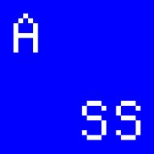

# Apple System Styles

Preview and copy apple system colors and default type (large) text styles.

## 开发

项目使用 Vite+ 统一管理 Node.js、pnpm、开发服务器、静态检查、测试和生产构建：

```bash
vp install
vp dev
vp check
vp test
vp build
```

升级工具链时，先运行 `vp upgrade` 更新全局 CLI，再在项目根目录运行 `vp migrate`，确保 Vite+ 及其托管组件保持版本一致。
